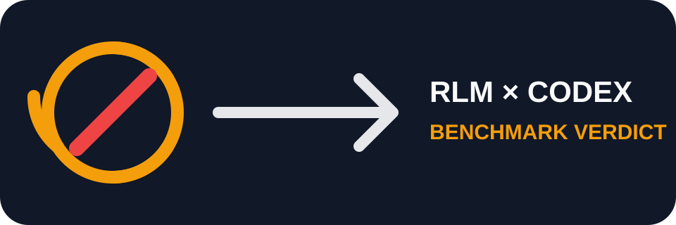

# OOLONG Codex benchmark



The partial result is documented in
[`reports/2026-08-12-partial-verdict.md`](reports/2026-08-12-partial-verdict.md).
It shows a preliminary quality signal but a large calls, latency and token penalty;
we do not recommend RLM as a generic Codex CLI layer for this workload.

Projeto isolado para comparar `gpt-5.6-terra` diretamente com o mesmo modelo dentro
do RLM local em 25 casos oficiais OOLONG `trec_coarse` de 131K.

```powershell
uv sync --group test
uv run pytest -q
uv run oolong-codex prepare
uv run oolong-codex run
uv run oolong-codex score
uv run oolong-codex report
uv run oolong-codex verify
```

O corpus, o ouro, checkpoints e respostas brutas ficam em `artifacts/` e não são
versionados. Os relatórios consolidados sem corpus são gravados em `reports/`.
